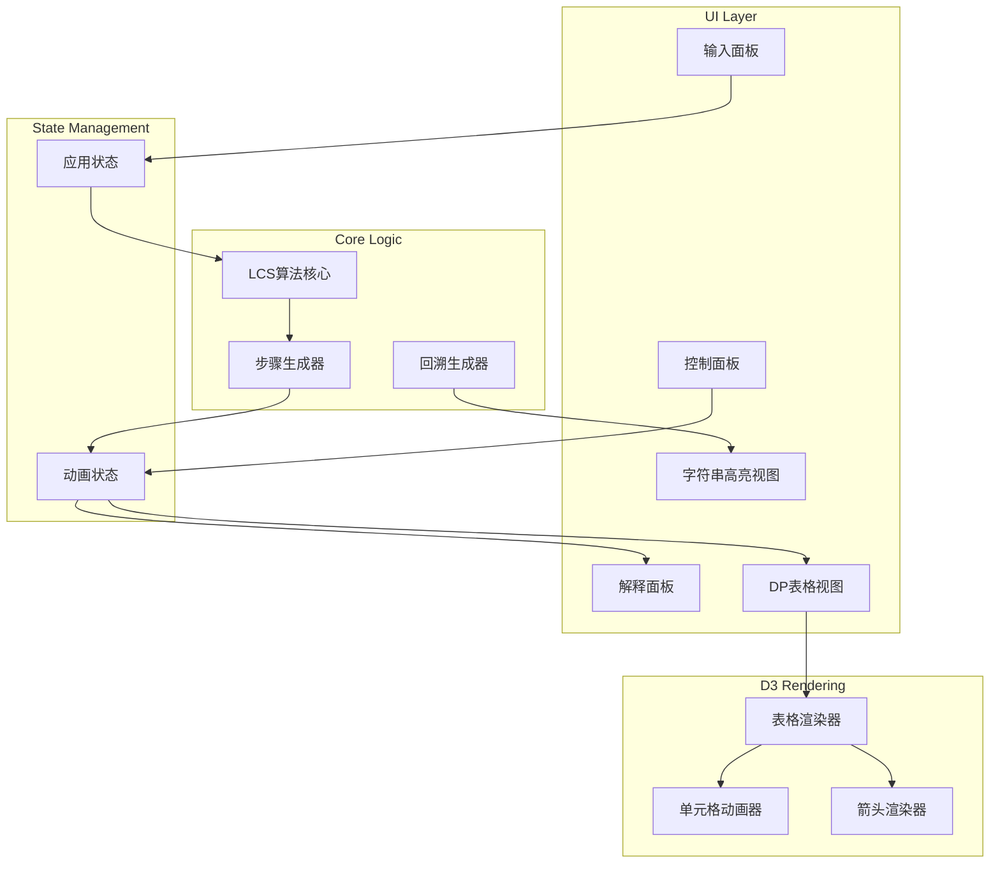

# Design Document: LCS Visualization

## Overview

本项目是一个基于TypeScript + React + D3.js的最长公共子序列(LCS)动态规划算法可视化工具。目标是通过交互式动画帮助算法初学者理解DP的核心思想：将大问题分解为小问题，通过填表法逐步求解。

核心功能包括：
- 字符串输入与验证
- DP表格的D3.js可视化渲染
- 逐步填充动画与状态转移高亮
- 播放控制（暂停、单步、速度调节）
- 中文解释面板
- 回溯路径可视化

## Architecture



## Components and Interfaces

### 1. App Component (主组件)
```typescript
interface AppProps {}

// 管理全局状态，协调各子组件
const App: React.FC<AppProps>
```

### 2. InputPanel Component (输入面板)
```typescript
interface InputPanelProps {
  onStart: (text1: string, text2: string) => void;
  disabled: boolean;
}

// 提供两个输入框和开始按钮
const InputPanel: React.FC<InputPanelProps>
```

### 3. ControlPanel Component (控制面板)
```typescript
interface ControlPanelProps {
  isPlaying: boolean;
  speed: number;
  canStepForward: boolean;
  canShowBacktrace: boolean;
  onPlayPause: () => void;
  onStepForward: () => void;
  onReset: () => void;
  onSpeedChange: (speed: number) => void;
  onShowBacktrace: () => void;
}

const ControlPanel: React.FC<ControlPanelProps>
```

### 4. DPTable Component (DP表格)
```typescript
interface DPTableProps {
  text1: string;
  text2: string;
  dpTable: number[][];
  currentStep: AnimationStep | null;
  highlightedCells: CellPosition[];
  backtrackPath: CellPosition[];
}

// 使用D3.js渲染DP表格
const DPTable: React.FC<DPTableProps>
```

### 5. ExplanationPanel Component (解释面板)
```typescript
interface ExplanationPanelProps {
  currentStep: AnimationStep | null;
  isComplete: boolean;
  lcsResult: string;
  lcsLength: number;
}

const ExplanationPanel: React.FC<ExplanationPanelProps>
```

### 6. StringDisplay Component (字符串显示)
```typescript
interface StringDisplayProps {
  text: string;
  label: string;
  highlightIndices: number[];
}

const StringDisplay: React.FC<StringDisplayProps>
```

### 7. LCS Algorithm Core (算法核心)
```typescript
interface LCSCore {
  // 生成所有动画步骤
  generateSteps(text1: string, text2: string): AnimationStep[];
  
  // 生成回溯路径
  generateBacktrace(
    text1: string, 
    text2: string, 
    dpTable: number[][]
  ): BacktraceResult;
  
  // 计算单个单元格的值
  computeCell(
    text1: string,
    text2: string,
    dpTable: number[][],
    i: number,
    j: number
  ): CellComputation;
}
```

### 8. Animation Controller Hook
```typescript
interface UseAnimationController {
  currentStepIndex: number;
  isPlaying: boolean;
  speed: number;
  play: () => void;
  pause: () => void;
  stepForward: () => void;
  reset: () => void;
  setSpeed: (speed: number) => void;
}

function useAnimationController(
  steps: AnimationStep[],
  onStepChange: (step: AnimationStep) => void
): UseAnimationController
```

## Data Models

### AnimationStep (动画步骤)
```typescript
interface AnimationStep {
  // 当前计算的单元格位置
  row: number;
  col: number;
  
  // 计算结果
  value: number;
  
  // 状态转移类型
  transitionType: 'match' | 'fromTop' | 'fromLeft';
  
  // 比较的两个字符
  char1: string;
  char2: string;
  
  // 来源单元格（用于高亮）
  sourceCells: CellPosition[];
  
  // 当前DP表状态（填充到当前步骤）
  dpTableSnapshot: number[][];
  
  // 比较信息（仅当字符不相等时使用）
  comparisonInfo?: {
    topValue: number;      // dp[i-1][j]的值
    leftValue: number;     // dp[i][j-1]的值
    topCell: CellPosition; // 上方单元格位置
    leftCell: CellPosition; // 左方单元格位置
  };
}
```

### CellPosition (单元格位置)
```typescript
interface CellPosition {
  row: number;
  col: number;
}
```

### CellComputation (单元格计算)
```typescript
interface CellComputation {
  value: number;
  transitionType: 'match' | 'fromTop' | 'fromLeft';
  sourceCells: CellPosition[];
}
```

### BacktraceResult (回溯结果)
```typescript
interface BacktraceResult {
  // 回溯路径上的所有单元格
  path: CellPosition[];
  
  // 匹配的单元格（对角线移动）
  matchCells: CellPosition[];
  
  // LCS字符串
  lcs: string;
  
  // text1中LCS字符的索引
  text1Indices: number[];
  
  // text2中LCS字符的索引
  text2Indices: number[];
}
```

### AppState (应用状态)
```typescript
interface AppState {
  // 输入字符串
  text1: string;
  text2: string;
  
  // 当前阶段
  phase: 'input' | 'animating' | 'complete' | 'backtracing';
  
  // 所有动画步骤
  steps: AnimationStep[];
  
  // 当前步骤索引
  currentStepIndex: number;
  
  // 完整的DP表
  dpTable: number[][];
  
  // 回溯结果
  backtraceResult: BacktraceResult | null;
  
  // 动画控制
  isPlaying: boolean;
  speed: number; // 0.5 - 3.0
}
```

## Correctness Properties

*A property is a characteristic or behavior that should hold true across all valid executions of a system-essentially, a formal statement about what the system should do. Properties serve as the bridge between human-readable specifications and machine-verifiable correctness guarantees.*

### Property 1: Input Length Validation
*For any* input string, the validation function SHALL accept strings with length between 1 and 10 (inclusive) and reject strings outside this range.

**Validates: Requirements 1.2**

### Property 2: Input Character Validation
*For any* input string, the validation function SHALL accept strings containing only lowercase English letters (a-z) and reject strings containing any other characters.

**Validates: Requirements 1.3**

### Property 3: DP Table Initialization Correctness
*For any* two valid input strings of lengths m and n, the initialized DP table SHALL have dimensions (m+1) × (n+1), with all cells in the first row and first column set to 0.

**Validates: Requirements 2.1, 2.4**

### Property 4: DP State Transition Correctness
*For any* two valid input strings and any cell position (i, j) where i > 0 and j > 0:
- IF text1[i-1] === text2[j-1], THEN dp[i][j] SHALL equal dp[i-1][j-1] + 1
- IF text1[i-1] !== text2[j-1], THEN dp[i][j] SHALL equal max(dp[i-1][j], dp[i][j-1])

**Validates: Requirements 3.2, 3.3**

### Property 5: LCS Result Validity
*For any* two valid input strings, the computed LCS string SHALL:
1. Be a valid subsequence of text1
2. Be a valid subsequence of text2
3. Have length equal to dp[m][n]

**Validates: Requirements 5.3**

### Property 6: Code Line Highlighting Correctness
*For any* animation step, the highlighted code lines SHALL correctly correspond to the transition type:
- If transitionType is 'match', lines 9 and 11 (if branch with dp[i-1][j-1]+1) SHALL be highlighted
- If transitionType is 'fromTop' or 'fromLeft', lines 12 and 14 (else branch with Math.max) SHALL be highlighted

**Validates: Requirements 7.3, 7.4**

## Error Handling

### Input Validation Errors
- 空字符串：显示提示"请输入至少1个字符"
- 超长字符串：显示提示"字符串长度不能超过10个字符"
- 非法字符：显示提示"只能输入小写英文字母(a-z)"
- 输入时实时过滤非法字符

### Animation Errors
- 步骤越界：自动停止在最后一步
- 速度值越界：限制在0.5-3.0范围内

### State Recovery
- 任何错误状态下，重置按钮始终可用
- 重置后恢复到初始输入状态

## Testing Strategy

### Unit Testing (Vitest)
使用Vitest进行单元测试：

1. **输入验证测试**
   - 测试有效长度边界（1字符、10字符）
   - 测试无效长度（0字符、11字符）
   - 测试有效字符（纯小写字母）
   - 测试无效字符（大写、数字、特殊字符）

2. **DP算法测试**
   - 测试已知示例（"abcde" + "ace" = 3）
   - 测试相同字符串（"abc" + "abc" = 3）
   - 测试无公共子序列（"abc" + "def" = 0）
   - 测试单字符情况

3. **回溯测试**
   - 验证回溯路径的正确性
   - 验证LCS字符串是两个输入的有效子序列

### Property-Based Testing (fast-check)
使用fast-check库进行属性测试：

1. **输入验证属性测试**
   - 生成各种长度的字符串，验证长度验证逻辑
   - 生成包含各种字符的字符串，验证字符验证逻辑

2. **DP表初始化属性测试**
   - 生成随机有效字符串对，验证表格尺寸和初始值

3. **状态转移属性测试**
   - 生成随机有效字符串对，验证每个单元格的计算符合状态转移方程

4. **LCS结果属性测试**
   - 生成随机有效字符串对，验证结果是有效的公共子序列

### Test Annotation Format
每个属性测试必须使用以下格式注释：
```typescript
// **Feature: lcs-visualization, Property {number}: {property_text}**
```
